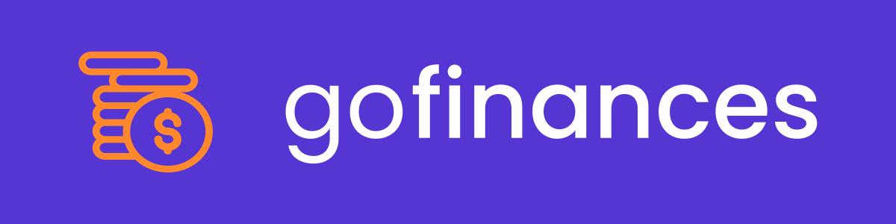
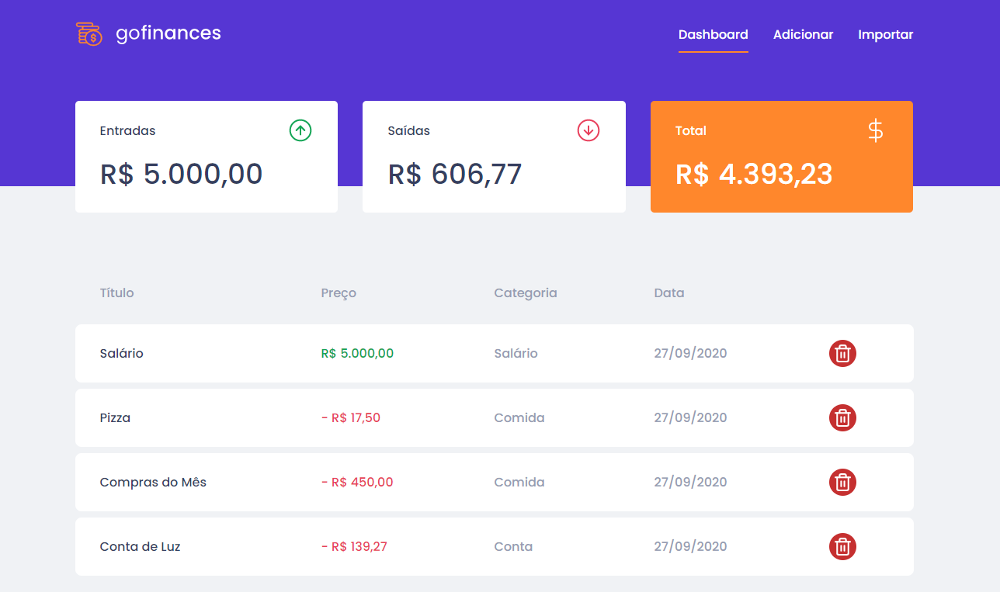

<h1 align="center">
  GoFinances
</h1>

GoFinances é uma aplicação de controle financeiro onde você faz um gerenciamentos dos seus ganhos e gastos, para ter melhor controle das suas economias e ter um registro de todas as movimentações da sua conta.

Essa aplicação foi desenvolvida através de dois desafios proposto pela RocketSeat no Bootcamp GoStack, onde um desafio era construir a API e o outro o Front-end Web da aplicação.

## Principais tecnologias e ferramentas utilizadas
- [ReactJS](https://reactjs.org/)
- [Node.js](https://nodejs.org/en/)
- [TypeScript](https://www.typescriptlang.org/)
- [Express](https://expressjs.com/)
- [TypeORM](https://typeorm.io/#/)
- [Styled Components](https://styled-components.com/)

## Como instalar
### Gerenciador de dependências
Para poder continuar com a instalação dessa aplicação você deve ter instalado em seu computador o <b>Yarn</b> ou <b>NPM</b>, para que possa instalar as dependências da aplicação.

### Instalação
Faça um fork ou clone deste repositório para sua máquina, após isso abra o terminal de comando na pasta do repositório clonado, acesse as pastas `./api` e `./web` e depois digite `yarn` ou `npm` para que todas as dependências sejam instaladas.

### Configurando a API
No GoFinances é utilizado o [TypeORM](https://github.com/typeorm/typeorm) para fazer conexão com o banco de dados, então crie um banco para o GoFinances, abra o arquivo `api/ormconfig.json` e faça a configuração do seu banco. Para configurar as informações do seu banco tenha em mente os bancos que tem compatibilidade com o TypeORM, consulte os [Tipos de Conexões](https://typeorm.io/#/connection-options/common-connection-options) que podem ser feitas no TypeORM e como fazê-las.

### Iniciando a aplicação Web
Com todas as dependências instaladas, abra o terminal, acesse a pasta `web` e digite `yarn start` ou `npm start` para que sua aplicação seja iniciada, após alguns segundos uma página web será aberta automáticamente no seu <b>localhost</b> utilizando a porta <b>3000</b>.

## Considerações finais
Esta aplicação foi desenvolvida a partir do Bootcamp da Rocketseat para praticar os fundamentos do ReactJS e também para consumir uma API.

## :memo: Licença

Esse projeto está sob a licença MIT. Veja o arquivo [LICENSE](LICENSE.md) para mais detalhes.

---
